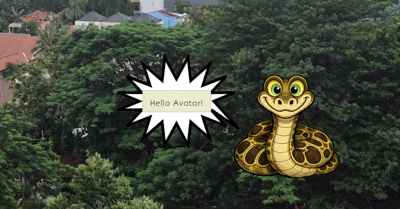

xkaa
====

A Python 3 rework of xcowsay (http://www.doof.me.uk/xcowsay/). The name is inspired by Kaa, the python from 'The Jungle Book'. The x is for X-window, but it also works in Wayland. It also should sound close to 'xcow'.

Display fun character speech bubbles on your desktop with custom text, dynamic sizing, and organic SVG-rendered speech bubble tails!

## Features

- **Dynamic speech bubbles** that automatically resize based on text length
- **SVG-rendered tails** with smooth, organic curved shapes
- **Multiple balloon styles**: say, shout, think, dream
- **Flexible bubble placement**: left, right, or random positioning
- **Multiple characters**: kaa, donkey, chicken, bat, and more
- **Legacy character support**: access classic character images with `-l` flag
- **Customizable text colors**: black, red, blue, green
- **Auto-close timer**: automatically dismiss after a set duration
- **Interactive**: drag to move, click to close

## Requirements

- Python 3
- GTK 4.0
- Pillow (PIL)
- PyGObject
- cairosvg

## Installation

### From source
```bash
pip install -r requirements.txt
```

### On Fedora (RPM)

#### Install pre-built package
```bash
sudo dnf install xkaa
```

#### Build from source
```bash
# Install build dependencies
sudo dnf install rpm-build rpmdevtools

# Set up RPM build environment
rpmdev-setuptree

# Create source tarball
tar --exclude='.git' -czf xkaa-0.2.tar.gz xkaa/
mv xkaa-0.2.tar.gz ~/rpmbuild/SOURCES/

# Copy spec file and build
cp xkaa/xkaa.spec ~/rpmbuild/SPECS/
cd ~/rpmbuild/SPECS
rpmbuild -ba xkaa.spec

# Install the built RPM
sudo dnf install ~/rpmbuild/RPMS/noarch/xkaa-0.2-1.fc*.noarch.rpm
```

See [BUILD_RPM.md](BUILD_RPM.md) for detailed instructions.

## Usage

```bash
xkaasay -c kaa -a say -t "Hello World!" -i blue -p right
```

### Command Line Options

- `-t, --text TEXT` : Text to display (default: "Hello World! Use -h for help")
- `-a, --action ACTION` : Balloon type - say, shout, think, or dream (default: say)
- `-c, --character CHARACTER` : Character name - kaa, donkey, chicken, bat, etc. (default: kaa)
- `-i, --ink COLOR` : Text ink color - black, red, blue, green (default: black)
- `-p, --placement POSITION` : Bubble placement - left, right, or random (default: random)
- `-d, --dream IMAGE` : Path to dream image for dream action (default: images/baloo.png)
- `-l, --legacy` : Use legacy character images from images/legacy/ directory
- `-s, --sleep SECONDS` : Automatically close after specified number of seconds
- `-h, --help` : Show help message

### Examples

Simple greeting with default character (kaa):
```bash
xkaasay -t "Hello!"
```

Bubble on the right with blue text:
```bash
xkaasay -c donkey -t "Welcome to xKaa!" -i blue -p right
```

Thought bubble:
```bash
xkaasay -c chicken -a think -t "What should I code today?"
```

Dream bubble with default image (baloo):
```bash
xkaasay -a dream
```

Dream bubble with custom image:
```bash
xkaasay -c bat -a dream -d /path/to/image.png
```

Use legacy character images:
```bash
xkaasay -l -c snake -t "Classic snake!"
```

Auto-close after 5 seconds:
```bash
xkaasay -t "This will disappear in 5 seconds" -s 5
```

### Interactive Controls

- **Left click and drag**: Move the window around the screen
- **Right click or ESC**: Close the window
- **Auto-close**: Use `-s SECONDS` to automatically close after a specified duration

## Available Characters

The `images/` directory contains various characters. Common ones include:
- kaa (default)
- donkey  
- chicken
- bat
- baloo
- And more!

Legacy characters from the original xcowsay are available in `images/legacy/` and can be accessed using the `-l` flag.

## How It Works

xKaa creates beautiful speech bubbles using SVG path rendering with quadratic Bezier curves for smooth, organic tail shapes. The bubbles dynamically size based on text content, with intelligent text wrapping and proper elliptical inscription. The tail seamlessly connects to the bubble and points toward the character's mouth.

## License

Free software - character icons from Animal Icons collection by Martin Berube
http://www.softicons.com/animal-icons/animal-icons-by-martin-berube

## Credits

Inspired by xcowsay (http://www.doof.me.uk/xcowsay/)
Python rework by Salvatore Bognanni
